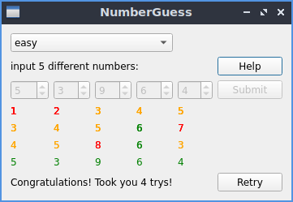
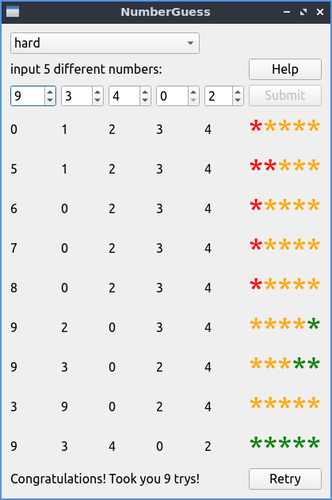

# Mastermind Game
This game was originally a board game from 1970.

The player has to guess a number of five digits. After each guess the player gets hints to determine which digits are correct.
- Green stands for a number you guessed correctly and put in the right spot in the number array.
- Orange stands for a number you guessed correctly, but is not in the right spot of the number array.
- Red stands for a number you guessed that doesn't belong in the number array.

The two modes, easy and hard, differentiate in the way, the results are shown. In easy mode, the color is directly associated with the numbers, while in hard mode, this direct association is missing. In hard mode, the player only gets feedback, how many numbers in the current guess belong to each of the three categories, but he doesn't get a hint, which.

---
## Implementation

The game was written with C++ and Qt. The play mode (hard/easy) can be selected in the upper dropdown box.





## Building the project
In Qt Creator, open the project file `src/NumberGuess.pro` or build the game from commandline:
```bash
$ sudo apt-get update
$ sudo apt-get install build-essential
$ sudo apt-get install qtcreator
cd NumberGuess/
mkdir bin
cd bin/
qmake ../NumberGuess.pro
make && make clean
./NumberGuess```

## License
[GNU General Public License 3](LICENSE)
